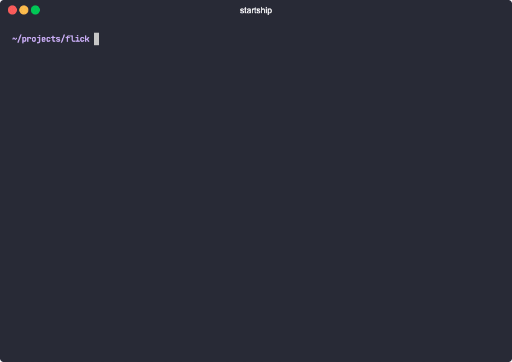

# startship



```shell script
$ brew install saket/repo/startship
$
$ cd ~/path/to/your/library/project
$ startship release && say "released"
```

`startship` makes the process of releasing JVM libraries _a bit_ easier by automating usage of Sonatype Nexus so that you don't have to constantly refresh your browser after every operation to check if has gone through yet. 

`startship` will read your library's maven coordinates from `gradle.properties`, find your staged repository, request it to be closed, wait till it's closed, promote it to release, and finally wait till it's synced to maven central. It also tries to be helpful by making sure you don't release an incorrect artifact by comparing maven coordinates and versions.

The following Gradle properties are expected in the project's `gradle.properties`:
```properties
GROUP=com.example
POM_ARTIFACT_ID=nicolascage
VERSION_NAME=4.2.0
```

Alternatively, you can provide the Maven coordinates with the `-c` option. If you'd like to verify multiple artifacts
are released with the same group and version, the artifacts can be comma-delimited.
```shell script
# Single artifact:
$ startship release -c com.example:nicolascage:4.2.0

# Multiple artifacts
$ startship release -c com.example:nicolascage,dianekruger:4.2.0
```

Additionally, the following properties are needed in your machine's `gradle.properties` to perform operations with your
Sonatype Nexus account:
```properties
SONATYPE_NEXUS_USERNAME=username
SONATYPE_NEXUS_PASSWORD=password
```

Alternatively, you can provide these to the command line with the `-u` and `-p` options, respectively. The values passed
to `-u` and `-p` can be either Gradle property keys or the actual username or password values.
```shell script
$ startship release -u yourActualUsername -p YOUR_PASSWORD_GRADLE_PROPERTY
```

### Contributing and running locally

Sonatype's endpoints are badly documented and can be really flaky at times, causing `startship` to fail. If you run into issues, please consider [sending a PR](https://github.com/saket/startship/pulls). For your local development, `startship` can be modified to run in mock mode:


```diff
 // AppModule.kt
 val nexus = RealNexus(
-  api = nexusModule.nexusApi,
+  api = MockNexusApi(pom),
   debugMode = debugMode,
-  config = NexusConfig.DEFAULT,
+  config = MOCK_NEXUS_CONFIG,
   scheduler = Schedulers.single()
 )
```

Next, run `startship` using:

```
./run release -c com.example:nicolascage:4.2.0
```

### License

```
Copyright 2020 Saket Narayan.

Licensed under the Apache License, Version 2.0 (the "License");
you may not use this file except in compliance with the License.
You may obtain a copy of the License at

   http://www.apache.org/licenses/LICENSE-2.0

Unless required by applicable law or agreed to in writing, software
distributed under the License is distributed on an "AS IS" BASIS,
WITHOUT WARRANTIES OR CONDITIONS OF ANY KIND, either express or implied.
See the License for the specific language governing permissions and
limitations under the License.
```
